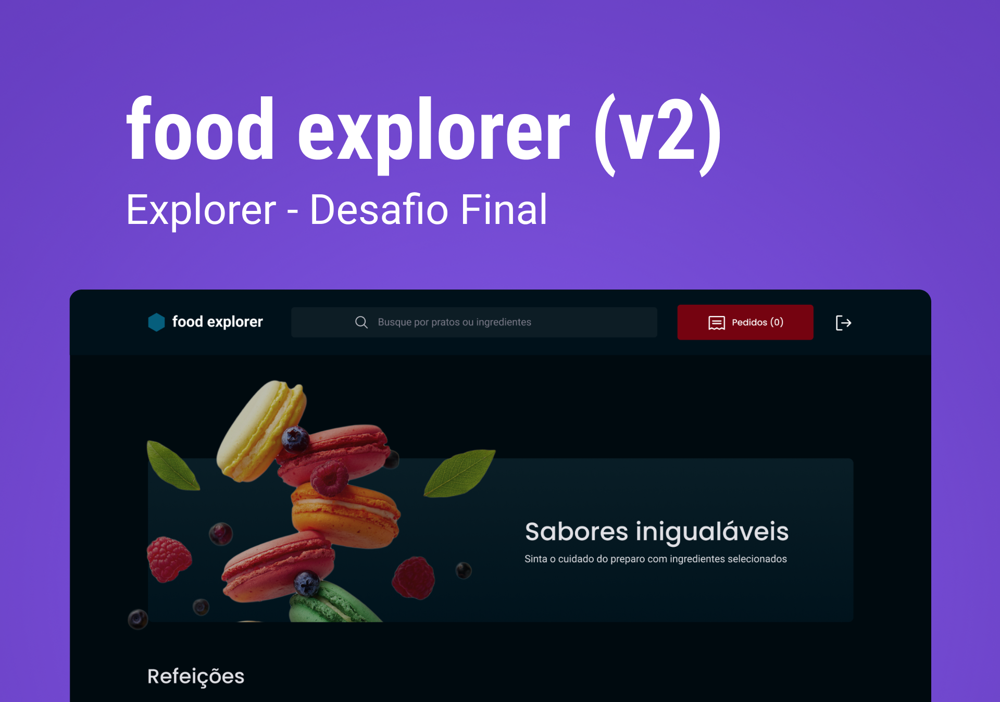

# foodExplorer

## Projeto de backend para aplicação foodExplorer

<p align="center">
  <h1 align="center"><a href="https://stately-cajeta-ac26ef.netlify.app/">foodExplorer - Rocketseat Explorer 🚀 </a></h1>
</p>

___

## 💻 Sobre

O foodExplorer é uma aplicação web fictícia para gerenciamento de restaurantes e solicitação de direta pelo cliente. A aplicação é totalmente responsiva para a utilização através dos mais diversos dispositivos! Após o cadastro na plataforma o usuário terá as permissões necessárias para criar cada pedido e acompanhar seu status. Como parte do desafio foi desenvolvida uma seção para os favoritos na página Home e uma página exclusiva para listagem de favoritos. A funcionalidade de carrinho e pagamento constam como opcional e serão desenvolvidos posteriormente. A aplicação é 100% funcional e o usuário pode navegar por diversas páginas e utilizar a barra lateral com controle dinâmico de aparência para navegação. Além disso, o avatar do usuário é disponibilizado no cabeçalho, permitindo que este atualize seus dados. O Administrador terá a capacidade de criar/editar/remover os pratos da forma que desejar.

Este repositório são encontrados os arquivos referentes ao BackEnd em Node.js desenvolvido para a resolução do desafio. Como forma de avançar ainda mais nos conhecimento sobre desenvolvimento de sistemas, utilizando bibliotecas e ferramentas atuais e demandadas pelo mercado, esta API utiliza o ORM Prisma para acesso do banco de dado em SQLite. Além disso, uma prévia de como poderia ser implementado em mySQL também se encontra disponível, ficando como trabalho futuro a transição para um sistema mais robusto e amplamente utilizado, o qual deverá ser provisionado através do Docker para acesso localmente e possivelmente em alguma plataforma cloud. Uma outra milha ainda foi percorrida, a API foi desenvolvida utilizando o TypeScript.

___

## 🎨 Layout

O layout com todas as páginas obrigatórias e opcionais foi disponibilizada no figma por meio [DESSE LINK](https://www.figma.com/file/LOMJWIopGI0VwmAU9aT2YS/food-explorer-v2?node-id=201-1532&t=zm3uJVZpfRMLBSLd-0).



## 📊📂🛠️ Projeto de execução

Foi desenvolvido um projeto de execução das atividades no Notion, pode-se verificar através [DESSE LINK](https://tremendous-mum-29f.notion.site/38b6fb43468a4aa4a042ac6b5c54fa5d?v=1f969ed94b7244db98ba7e2d0d51f704).

## 🛠 Tecnologias

As seguintes tecnologias foram empregadas na criação deste projeto:

- [Node.js](https://nodejs.org/en/)
- [Javascript](https://developer.mozilla.org/pt-BR/docs/Web/JavaScript)
- [Typescript](https://www.typescriptlang.org/pt/)
- [Express](https://expressjs.com)
- [Nodemon](https://nodemon.io/)
- [SQLite](https://www.sqlite.org/index.html)
- [Prisma](https://www.prisma.io/)
- [BCryptjs](https://www.npmjs.com/package/bcryptjs)
- [JSON Web Token](https://www.npmjs.com/package/jsonwebtoken)
- [Multer](https://www.npmjs.com/package/multer)
- [CORS](https://www.npmjs.com/package/cors)
- [Axios](https://www.npmjs.com/package/axios)

___

## 🚀 Como utilizar

Clone o projeto para o local desejado em seu computador.

```bash
git clone https://github.com/jakunzler/foodExplorer-backend
```

___

### 🚧 Executando o BackEnd

```bash
# No BackEnd insira uma porta e as demais variáveis de ambiente no arquivo .env vazio
  PORT=
  SECRET_KEY_JWT=
  TOKEN_EXPIRES_IN=
  RESET_CODE_EXPIRES_IN=

# Navegue até o diretório do BackEnd
$ cd foodExplorer-backend

# Instale as dependências necessárias
$ yarn

# Ative as migrações do gerenciador de banco de dados
$ yarn prisma migrate dev

# Agora inicie o servidor do BackEnd
$ yarn dev
```

___

## Estrutura de pastas

```markdown
foodExplorer-backend/
├── node_modules/
│   └── ...
├── src/
│   ├── assets/
│   │   └── ...
│   ├── config/
│   │   └── ...
│   ├── db/
│   │   └── ...
│   ├── exceptions/
│   │   └── ...
│   ├── models/
│   │   └── ...
│   ├── modules/
│   │   └── ...
│   ├── providers/
│   │   └── ...
│   ├── routes/
│   │   └── ...
│   ├── tests/
│   │   └── ...
│   ├── utils/
│   │   └── ...
│   ├── index.ts
├── tmp/
│   ├── uploads/
│   │   └── ...
│   ├── .gitkeep
├── vitest/
│   └── ...
├── .gitignore
├── .prettierignore
├── .prettierrc.json
├── docker-compose.yml
├── Dockerfile
├── package.json
├── prettier.config.js
├── README.md
├── tsconfig.json
├── vite.config.ts
└── yarn.lock
```

___

⚠️ **Importante**: Este projeto utiliza uma hospedagem gratuita para o back-end, portanto, pode haver atrasos no tempo de resposta do servidor e informações podem ser perdidas por inatividade no hospedeiro.

## 👩🏾‍💻 Personas

A aplicação foodExplorer possui duas personas principais: o admin e o usuário, mas foi previsto um terceiro usuário como suporte que tem acesso semelhante ao administrador. É possível criar um novo usuário ou testar a aplicação usando as seguintes informações de login:

Admin:

- E-mail: <admin@email.com>
- Senha: 123456

O admin tem acesso privilegiado e pode gerenciar o cardápio, adicionando, editando e removendo pratos, além de executar outras tarefas administrativas.

Usuário:

- E-mail: <user@email.com>
- Senha: 123456

O usuário tem acesso restrito às funcionalidades da aplicação, podendo visualizar o cardápio, filtrar pratos, ver detalhes de pratos específicos, favoritar pratos e adicionar pratos ao carrinho.

## 📝 Licença

Este projeto está sob a licença MIT.

___

Feito com 💜 by Jonas Augusto Kunzler 👋🏾
